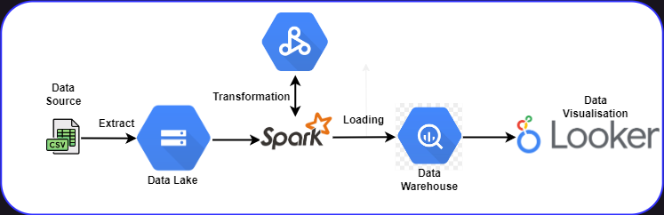

## Capstone Project: Batch Processing- No-Show Appointment Dataset

## Project Description
This project seeks to investigate hospital appointments no-show trends. is attendance a function of age, ailment type or proximity to the hospital? It may also be that SMS prompt play a vital role in helping people honor hospital appointments. 

    ## Questions for Analysis
    * What age ranges are more likely to honor appointments as well as the ages that most likely wouldn't?
    * Does SMS prompts play an important role in appoinment showup rates?
    * What percentage of males and females are enrolled in welfare programs?
    
## Objective 
To satisfy an end-to-end data engineering life cycle.

## Technology Stack
The following technologies are used to build this project
- Google Cloud Storage (GCS) - as Data Lake <br>
- PySpark - for transformation and data modeling <br>
- Google BigQuery - for Data Warehouse <br>
- Google Looker studio - for visualizations <br>
## Data Pipeline Architecture


## Reproduce it yourself
1. First clone this repo to your local machine.

`git clone https://github.c`

2. Setup your Google Cloud environment
- Create a [Google Cloud Platform project](https://console.cloud.google.com/cloud-resource-manager)
- Configure Identity and Access Management (IAM) for the service account, giving it the following privileges:
    - Viewer
    - Storage Admin
    - Storage Object Admin
    - BigQuery Admin
- Download the JSON credentials and save it, e.g. to `~/.gc/<credentials>`
- Install the [Google Cloud SDK](https://cloud.google.com/sdk/docs/install-sdk)
- Let the [environment variable point to your GCP key](https://cloud.google.com/docs/authentication/application-default-credentials#GAC), authenticate it and refresh the session token
```bash
export GOOGLE_APPLICATION_CREDENTIALS=<path_to_your_credentials>.json
gcloud auth activate-service-account --key-file $GOOGLE_APPLICATION_CREDENTIALS
gcloud auth application-default login
```
Check out this [link](https://www.youtube.com/watch?v=Hajwnmj0xfQ&list=PL3MmuxUbc_hJed7dXYoJw8DoCuVHhGEQb&index=11&t=29s)  for a video walkthrough.

3. Setup the necessary dependencies to run Apache Spark and interact with it using Pyspark within your local machine. This will be needed because I used pyspark for tranformation and schema design for this project. See [here](https://github.com/DataTalksClub/data-engineering-zoomcamp/tree/main/week_5_batch_processing/setup) for an instructional guide.

4. Create a pipeline that loads your parquet files from an API to your Data Lake just as seen [here](code/4_Spark_to_GCS.ipynb)

6. Create a compute engine instance on Google cloud to enable you run a dataproc job within a severless environment which also gives the felxibility of scheduling. See [here](https://www.youtube.com/watch?v=osAiAYahvh8&list=PL3MmuxUbc_hJed7dXYoJw8DoCuVHhGEQb&index=56) for a video guide.

7. Upload your python script containing your Spark job script to GCS and run your compute engine from the command line using the code below. Make sure you edit all parts that references my google cloud configurations to yours. 

```bash
gcloud dataproc jobs submit pyspark \
    --cluster=de-zoomcamp-cluster \
    --region=northamerica-northeast2 \
    --project=khunmi-academy-376002 \
    --jars=gs://spark-lib/bigquery/spark-bigquery-latest_2.12.jar \
    gs://dtc_data_lake_khunmi-academy-376002/code/capstone_proj.py \
    -- \
        --input_data=gs://dtc_data_lake_khunmi-academy-376002/capstone/ \
        --output=trips_data_all.capstone2023
```

8. Google Data Studio: To generate insights from my dataset, I connected my data source located in my data warehouse(Bigquery). Have a look at my dashboard link [here](https://lookerstudio.google.com/reporting/d7164b60-c4ee-4c65-937d-d10a23b1a75d)

[](images/dashboard.png)

### Dataset Description

This dataset collects information from 100k medical appointments in Brazil and is focused on the
question of whether or not patients show up for their appointment. A number of characteristics
about the patient are included in each row.‘ScheduledDay’ tells us on what day the patient setup their appointment.‘Neighborhood’ indicates the location of the hospital.‘Scholarship’ indicates whether or not the patient is enrolled in Brasilian welfare program Bolsa Família:

    |  | Variable|                Data_ Type|
    |1.| PatientId|                   float64|
    |2.| Appointment|                 IDint64|
    |3.| Gender|                       object|
    |4.| ScheduledDay|                 object|
    |5.| AppointmentDay|               object|
    |6.| Age|                           int64|
    |7.| Neighbourhood|                object|
    |8.| Scholarship|                   int64|
    |9.| Hipertension|                  int64|
    |10.| Diabetes|                     int64|
    |11.| Alcoholism|                   int64|
    |12.| Handicap|                      int64|
    |13.| SMS_received|                 int64|
    |14.| No-show |                    object|

9. Future work
- Getting more comfortable using Ifrastucture as code within my porject such as Terraform
- Including an orchestartion to make my process more automated such Prefect or Airflow
- Add more tests
- Add CI/CD pipeline
- Make incremental model, to append only the latest data from each load
- Transformations, documentation and data quality tests in dbt
- Streaming process with Kafka and Spark